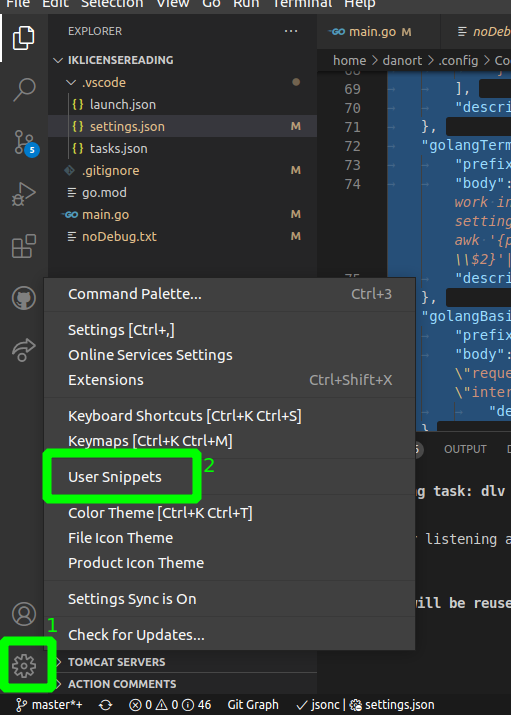
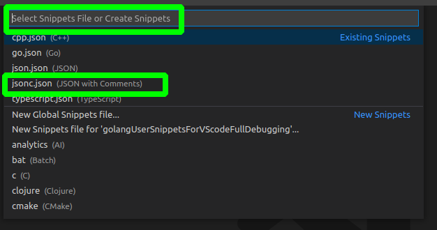
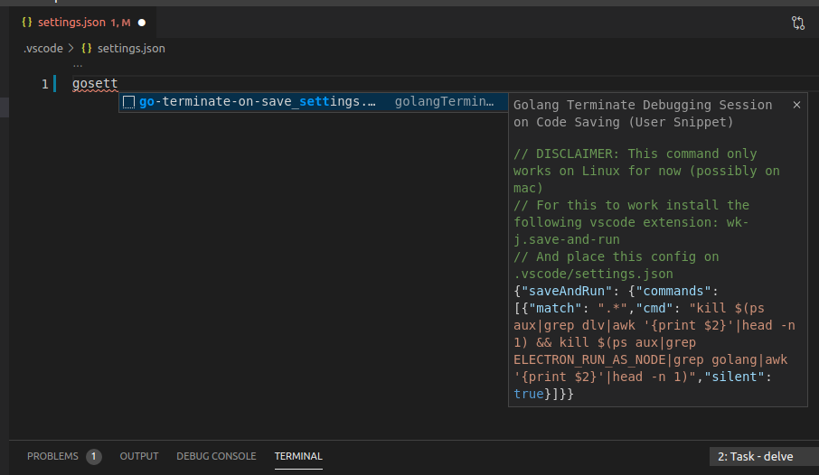

# golangUserSnippetsForVScodeFullDebugging

Copy all the contents of jsonc.json into the jsonc.json file of the User Snippets configuration.\
\
then ...\

Then create the following files:\
.vscode/launch.json\
.vscode/tasks.json (Recommended [but still Optional] required if willing to run Golang code that has CLI functionality)\
.vscode/settings.json (Optional required if willing to stop debugging automatically on save on Linux)

On each of those files type "go" followed by part of the name of the file (to filter the options).\
E.g. To auto populate the config for the settings.json file type "gosett", then hit enter\
(then adjust format if you want it)

**Note:** Two options are presented for launch.json.\
* One for an improved basic launcher that works with the "Debug Console".
* And another for Golang code that has CLI functionality (which requires the tasks.json file with the corresponding snippet and works with the integrated terminal).

**Another important Note:** Two options are presented for settings.json.\
* Basic save-terminate: works for both ImprovedBasic and CLI launchers, but doesn't differentiate between more than one vscode Golang debugging sessions
* Advanced save-terminate: differentiates between workspace sessions, but only works with Golang CLI launch.json and tasks.json
